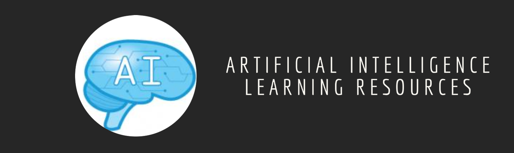

### Learn Artificial Intelligence

    

- #### Courses/Tutorials
    - [MIT: Intro to Deep Learning](https://introtodeeplearning.com) - A seven day bootcamp designed in MIT to introduce deep learning methods and applications
    - [Deep Blueberry: Deep Learning book](https://mithi.github.io/deep-blueberry) - A free five-weekend plan to self-learners to learn the basics of deep-learning architectures like CNNs, LSTMs, RNNs, VAEs, GANs, DQN, A3C and more
    - [Spinning Up in Deep Reinforcement Learning](https://spinningup.openai.com/) - A free deep reinforcement learning course by OpenAI
    - [MIT Artifical Intelligence Videos](http://ocw.mit.edu/courses/electrical-engineering-and-computer-science/6-034-artificial-intelligence-fall-2010/lecture-videos) - MIT AI Course
    - [Grokking Deep Learning in Motion](https://www.manning.com/livevideo/grokking-deep-learning-in-motion?a_aid=algmotion&a_bid=5d7bc0ba) - Beginner's course to learn deep learning and neural networks without frameworks.
    - [Intro to Artificial Intelligence](https://www.udacity.com/course/cs271) - Learn the Fundamentals of AI. Course run by Peter Norvig
    - [EdX Artificial Intelligence](https://www.edx.org/course/artificial-intelligence-uc-berkeleyx-cs188-1x-0#.VMeIsmSsVkg) - The course will introduce the basic ideas and techniques underlying the design of intelligent computer systems
    - [Artificial Intelligence For Robotics](https://www.class-central.com/mooc/319/udacity-artificial-intelligence-for-robotics) - This class will teach you basic methods in Artificial Intelligence, including: probabilistic inference, planning and search, localization, tracking and control, all with a focus on robotics
    - [Machine Learning](https://class.coursera.org/ml-008) - Basic machine learning algorithms for supervised and unsupervised learning
    - [Neural Networks For Machine Learning](https://www.coursera.org/course/neuralnets) - Algorithmic and practical tricks for artifical neural networks.
    - [Deep Learning](https://in.udacity.com/course/deep-learning--ud730/) - An Introductory course to the world of Deep Learning. 
    - [Stanford Statistical Learning](http://online.stanford.edu/course/statistical-learning-winter-2014) - Introductory course on machine learning focusing on: linear and polynomial regression, logistic regression and linear discriminant analysis; cross-validation and the bootstrap, model selection and regularization methods (ridge and lasso); nonlinear models, splines and generalized additive models; tree-based methods, random forests and boosting; support-vector machines.
    - [Knowledge Based Artificial Intelligence](https://www.udacity.com/course/knowledge-based-ai-cognitive-systems--ud409) - Georgia Tech's course on Artificial Intelligence focussing on Symbolic AI.
    - [Deep RL Bootcamp Lectures](https://sites.google.com/view/deep-rl-bootcamp/lectures) - Deep Reinforcement Bootcamp Lectures - August 2017
    - [Machine Learning Crash Course By Google](https://developers.google.com/machine-learning/crash-course/ml-intro) Machine Learning Crash Course features a series of lessons with video lectures, real-world case studies, and hands-on practice exercises.
    - [Python Class By Google](https://developers.google.com/edu/python/) This is a free class for people with a little bit of programming experience who want to learn Python. The class includes written materials, lecture videos, and lots of code exercises to practice Python coding.
    - [Deep Learning Crash Course](https://www.manning.com/livevideo/deep-learning-crash-course) In this liveVideo course, machine learning expert Oliver Zeigermann teaches you the basics of deep learning.
    - [Deep Learning](http://www.deeplearningbook.org/) - Goodfellow, Bengio and Courville's introduction to a broad range of topics in deep learning, covering mathematical and conceptual background, deep learning techniques used in industry, and research perspectives. 
    - [The Elements of Statistical Learning: Data Mining, Inference, and Prediction](https://web.stanford.edu/~hastie/ElemStatLearn/) - Hastie and Tibshirani cover a broad range of topics, from supervised learning (prediction) to unsupervised learning including neural networks, support vector machines, classification trees and boosting---the first comprehensive treatment of this topic in any book.
    - [Elements of AI (Part 1) - Reaktor/University of Helsinki](https://www.elementsofai.com/) - An Introduction to AI is a free online course for everyone interested in learning what AI is, what is possible (and not possible) with AI, and how it affects our lives – with no complicated math or programming required.
    - [Kaggle's micro courses](https://www.kaggle.com/learn/overview) - A series of micro courses by offering practical and hands-on knowledge ranging from Python to Deep Learning.
    - [Scaler's Blogs](https://www.scaler.com/blog/category/artificial-intelligence-machine-learning/) - Explore in-depth articles on Artificial Intelligence and Machine Learning, covering concepts, tools, and real-world applications to advance your AI/ML knowledge.
    - [Applied AI Blogs](https://www.appliedaicourse.com/blog/) - Explore in-depth articles on Artificial Intelligence and Machine Learning, covering concepts, tools, and real-world applications to advance your AI/ML knowledge.
    - [AI & ML Course by Scaler Academy](https://www.scaler.com/ai-machine-learning-course/) - In-depth training on AI and ML with hands-on projects and expert mentorship.
