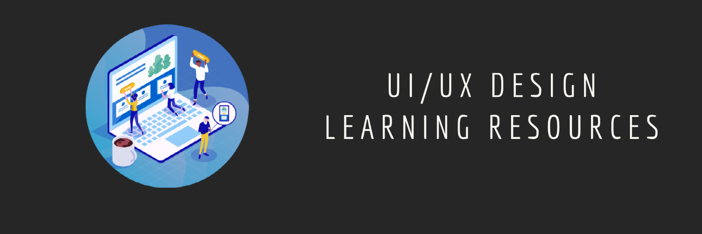

### Learn UI/UX Design

    

- #### Courses/Tutorials
  - [The Futur](https://www.youtube.com/user/TheSkoolRocks/videos) : Our mission is to teach 1 billion people how to make a living doing what they love.
  - [Mike Locke](https://www.youtube.com/user/mlwebco/videos) : Highly innovative, passionate and successful senior UI/UX designer with high proficiencies in Visual UI Design, User Experience, Usability, Interaction Design, Information Architecture, Research & Analytics, XHTML/CSS and Strategy & Planning.
  - [Flux](https://www.youtube.com/channel/UCN7dywl5wDxTu1RM3eJ_h9Q/videos) : Flux is the personal vlog of Ran Segall, a designer and entrepreneur.
  - [UX Mastery](https://www.youtube.com/user/uxmastery/videos) : Helping UXers get started, and get better. 
  - [Dansky](https://www.youtube.com/user/ForeverDansky/videos) : Dansky is a designer who loves to share his experience, and help aspiring creatives to develop their skills.
  - [Sketch Together](https://www.youtube.com/channel/UCZHkx_OyRXHb1D3XTqOidRw/videos) : This channel is dedicated to all things related to User Experience and User Interface design.
  - [Neuron UX](https://www.youtube.com/channel/UCHy67xvpFURfYodnzKRU3fA/videos) : Expertise in user experience design, strategy, and front-end development, we work together with you to develop a custom solution that meets your needs or those of your client.
  - [Tutvid](https://www.youtube.com/c/tutvid/videos) : Best Adobe Photoshop tutorials, Film editing videos, Premiere Pro tutorial, Adobe Illustrator tutorials, Adobe After Effects tutorials, Adobe Lightroom tutorials, Adobe Audition tutorials, Adobe XD tutorials, and Da Vinci Resolve videos. Grab some popcorn and stick around awhile!
  - [Caler Edwards](https://www.youtube.com/user/CalerEdwards/videos) :  This is a place to learn and be inspired about UI Design, UX Design, Digital Design and even Front-end Development. Posting tutorials, speed arts, challenges and so much more!
  - [Maex](https://www.youtube.com/c/SketchappTV/videos) : This channel is made by a designer for designers and create tutorials about Sketch, Adobe XD, InVision, Marvel & Principle and all the other UI/UX tools out there.
  - [UXLx - User Experience Lisbon](https://www.youtube.com/channel/UCvoEJgCYu1e6kvUvx7lN7kw) : Premier UX Conference in Lisbon, Portugal, with editions in 2010, 2011, 2012, 2013, 2014, 2015, 2016 and planned for 2017.
  - [UX Salon](https://www.youtube.com/c/UXSalon/videos) : We love User Experience Design. This channel is dedicated to highlight selected talks from our events.
  - [AJ&Smart](https://www.youtube.com/c/AJSmart/videos) : Work with some of the biggest companies in the world to help them build better products faster.  It's goal is to give you as much value as possible here on this Youtube channel.
  - [Figma Crash Course](https://www.figmacrashcourse.com/) : Deep dives into powerful Figma features. We’ll skip the basics and get into the nitty-gritty of prototyping, auto-layout, systems, and illustration.

- #### Understanding Tougher Topics  
  - [Laws of UX](https://lawsofux.com/) : It is a collection of the maxims and principles that designers can consider when building user interfaces.
  - [Atlassian Design](https://atlassian.design/) : Use Atlassian’s end-to-end design language to create simple, intuitive and beautiful experiences.
  - [inVision](https://www.invisionapp.com/inside-design/design-resources/) : Browse our library of free, high-quality UI kits, icon packs, and mockups.
  - [Bulbman-Art](https://bulbman.art/) : Free Artistic Illustrations for Designers

- #### Newsletters
  - [UI Dev Newsletter](https://mentor.silvestar.codes/reads) : Hand-curated list of articles, tutorials, opinions, and tools related to User Interface development
  - [Unreadit/Frontend](https://unreadit.com/n/frontend/) : Best frontend development news sourced from the best subreddits.
  - [Friday Front-end](https://zendev.com/friday-frontend.html) : 15 great Front-end articles, tutorials, and announcements every Friday. Sections for CSS/SCSS, JavaScript, and other awesome stuff.
  - [Dev Tips](https://umaar.com/dev-tips/) :  Developer tip, in the form of a gif, in your inbox each week
  - [Bytes](https://ui.dev/newsletters/bytes/) : Fun, lighthearted newsletter that covers new releases, emerging trends, and everything else you need to know about the present and future of the JavaScript ecosystem.

- #### UI Graphics: Websites and resources with modern UI components in different formats such as PSD, Sketch, Figma
  - [UI Design Daily](https://uidesigndaily.com/) :  Awesome UI Components of all types 
  - [100 Daily UI](https://100dailyui.webflow.io/) : Free Figma library of products, elements, and screens
  - [Sketch App Sources](https://www.sketchappsources.com/) : Sketch UIs, wireframes, icons and much more     
  - [Humaaans](https://www.humaaans.com/) :  Cool illustrations of people with the ability to mix and match
  - [Paaatterns](https://products.ls.graphics/paaatterns/) : Free collection of beautiful patterns for all vector formats
  - [thepatternlibrary](http://thepatternlibrary.com/) : Free beautiful background patterns              
  - [404 illustration](https://error404.fun/) : free illustrations for 404  pages                        
  - [Drawkit.io](https://www.drawkit.io/) : Illustrations for designers and startups                     
  - [Absurd.design](https://absurd.design/) : Free surrealist illustrations for designers and developers 
  - [Undraw.co](https://undraw.co/) : Open-source illustrations for any idea you can imagine and create  
  - [Manypixels.co](https://www.manypixels.co/gallery/) : Monochromatic, Isometric high-quality illustrations
  - [Open Peeps](https://www.openpeeps.com/) : Hand drawn illustration library                            
  - [UI Space](https://uispace.net/) : Thousands of great UI freebies                                     
  - [Animations.co](http://animaticons.co/) : Beautiful, customizable animated GIF icons                   
  - [Uplabs](https://www.uplabs.com/) : High-quality design resources (Free & Premium)                     
  - [InvisionApp](https://www.invisionapp.com/inside-design/design-resources/) : Library of free, high-quality UI kits, icon packs, and mockups     
  - [Open Doodles](https://www.opendoodles.com/) : Free Set of Sketchy Illustrations                    
  - [Avataaars](https://avataaars.com/) : Free sketch library of avatars illustrations by Pablo Stanley   
  - [FreebieSketch](http://freebiesketch.com/) : Free Sketch designs, wireframes, illustrations, and more.
  - [Blush](https://blush.design/) : Free customizable illustrations with Figma Plugin                  
  - [Hero Patterns](http://www.heropatterns.com/) : It is a collection of repeatable SVG background patterns   
  - [IsoFlat](https://isoflat.com/) : Set of free collection of Isometric SVG graphic resources               
  - [IRA Design](https://iradesign.io/) : It is an open-source gradient illustrations collection by creative tim.
  - [Storytale.io](https://storytale.io/freebies/) : Subset of Storytale free quality illustrations 
  - [icons8.com/illustrations](https://icons8.com/illustrations) : Free vector illustrations to class up your project 
  - [Patternico](https://patternico.com) : Seamless Pattern Maker 
  - [Freellustrations](https://freellustrations.com/) : Free Background Images for awesome landing Pages 
  - [Pixeltrue Illustrations](https://www.pixeltrue.com/illustrations) : Free Animated Illustrations 
  - [Abstract User Avatar API](https://www.abstractapi.com/user-avatar-api) : API to create simple yet flexible user avatars from user names or emails 
  - [sketchvalley](https://sketchvalley.com/) : Download free PNG, SVG or AI file . 
  - [PatternPad](https://patternpad.com/) : free and unlimited unique pattern designs. 
  - [Dimensions](https://www.dimensions.com/) : Dimensions.com is an ongoing reference database of dimensioned drawings documenting the standard measurements and sizes of the everyday objects and spaces
  - [Freebiesbug](https://freebiesbug.com/) : Hand-picked resources for web designers and developers, constantly updated.
  - [Flexiple](https://2.flexiple.com/scale/all-illustrations) : One new high-quality, open-source illustration each day. 

- #### Icons: Resources for Icons including png, svg and more

  - [UXWing](https://uxwing.com/) : Well Optimized, Free icons for commercial use 
  - [Shapedfonts Iconclub](https://shapedfonts.com/iconclub/) : 8000+ free icons 
  - [Feather Icons](https://feathericons.com/) : Beautiful, customizable open source icons 
  - [Tabler Icons](https://tablericons.com/) : 470+ highly customizable open source SVG icons 
  - [Simple Icons](https://simpleicons.org/) : 1307 Free SVG icons for popular brands 
  - [Linear Icons](https://linearicons.com/free) : 1000+ Ultra crisp vector icons 
  - [Icons8](https://icons8.com/) : Free icons, photos, vectors and tools 
  - [Flat Icon](https://www.flaticon.com/) : The largest database of free icons in PNG, SVG, EPS, PSD and BASE 64 formats  
  - [The Noun Project](https://thenounproject.com/) : Over 2 Million curated icons, created by a global community 
  - [Iconscout](https://iconscout.com/) : Free Download Icons illustrations stock photos at one place  
  - [IconSear.ch](https://iconsear.ch/search.html) : Search engine with over 50,000 SVG icons indexed 
  - [Nucleo App](https://nucleoapp.com/) : Nucleo is a beautiful library of 27500 icons, and a powerful application to collect, customize and export all your icons. (Free & Paid) 
  - [Icon-icons.com](https://icon-icons.com/) : Free Icons PNG, ICO, ICNS and Vector file SVG 
  - [Bootstrap Icons](https://icons.getbootstrap.com/) : Free Icons built for Bootstrap but they'll work in any project  
  - [Remix Icon](https://remixicon.com/) : Simply Delightful Icon System 
  - [Iconmonstr](https://iconmonstr.com/) : Discover 4496+ free icons in 313 collections 
  - [Vivid.js](https://webkul.github.io/vivid/) : Ready to use Free and Open Source SVG Icons Pack JavaScript Library. 
  - [Iconfinder](https://www.iconfinder.com/) : Free and premium vector icons in SVG, PNG, CSH and AI format  
  - [Lordicon](https://lordicon.com/free-icons) : 50 free animated interactive icons 
  - [UseAnimations](https://useanimations.com/) : Free Animated Icons in SVG and Json Format(for lottie)  
  - [css.gg](https://css.gg/) : 700+ Open-source CSS, SVG and Figma UI Icons Available in SVG Sprite, styled-components, NPM & API 
  - [IconBros](https://www.iconbros.com) : 7843+ free icons grouped in 182 collections 
  - [Material Design Icons](https://materialdesignicons.com/) : Set of icon collection allowing designers and developers targeting various platforms to download icons in the format, color and size they need for any project. 
  - [Heroicons](https://heroicons.dev/) : Free, open source icons from the creators of Tailwind CSS. 
  - [Zondicons](https://www.zondicons.com/icons.html) : Set of free premium SVG icons for you to use on your digital products. 
  - [Endless Icons](http://endlessicons.com/) : This website offering a number of free icons. Icons are tagged and also compressed into kits. 
  - [Icomoon](https://icomoon.io/app/) : Browse 5500+ Free Icons. Add any set you wish to easily browse and search its icons. 
  - [Eva Icons](https://akveo.github.io/eva-icons/#/) : Eva Icons is a pack of more than 480 beautifully crafted Open Source icons for common actions and items.
  - [Cryptoicons](http://cryptoicons.co/) : Set of 430 crypto and fiat currency icons. Completely free. 
  - [Ikonate](https://ikonate.com/) : Fully customizable & accessible vector icons 
  - [appicon](https://appicon.co/) : Quickly generate app icons in different sizes for your IOS, macOS and Android projects
  - [LineIcons](https://lineicons.com) : 2000+ Essential Line Icons for Designers and Developers 
  - [Evericons](https://www.figma.com/resources/assets/evericons-for-figma/) : Evericons is a big pack of over 460 free icons designed by Aleksey Popov. 
  - [SVG Repo](https://www.svgrepo.com/) : Download free SVG Vectors for commercial use. 
  - [Convertio](https://convertio.co/png-svg/) : Convert PNG files to SVG online & free. (One of the services provided by it.) 
  - [CSS ICON](https://cssicon.space/) : Icon set made with pure css code, no dependencies, "grab and go" icons 
  - [Unified icons](https://iconify.design/) : Thousands of icons, one unified framework. One library, over 40,000 vector icons. 
  - [System UIcons](https://systemuicons.com/) : 220+ icons in a growing collection. 
  - [IconPark](https://github.com/bytedance/IconPark) : Transform an SVG icon into multiple themes, and generate React icons，Vue icons，svg icons 
  - [Radix Icons](https://icons.modulz.app/) : Set of a crisp set of 15×15 icons designed by the Modulz team. All icons available as individual react component,SVG and more. 
  - [EOS Icons](https://icons.eosdesignsystem.com/) : Set of a pixel-perfect, open source iconic font available as ligature and SVG. 
  - [Ionicons](https://ionicons.com) : Beautifully crafted open source icons for use in web, iOS, Android, and desktop apps. 
  - [Phosphor Icons](https://phosphoricons.com) : Phosphor is a flexible icon family for interfaces, diagrams, presentations

