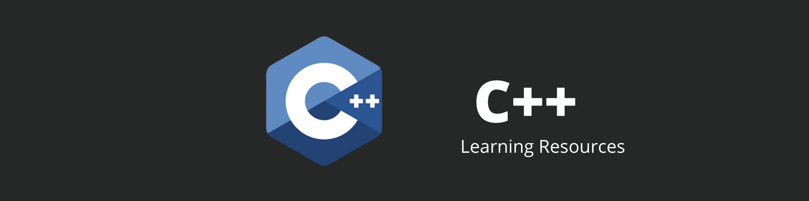

### Learn C++

    

- C++ [Docs](https://devdocs.io/cpp/) : UnOfficial Documentation

- #### Courses/tutorials

- [C++ Nanodegree Certification for Programmers](https://www.udacity.com/course/c-for-programmers--ud210?irclickid=xk8VEDWrFxyLUb-wUx0Mo3QBUkBx2rQp8zcwyk0&irgwc=1&utm_source=affiliate&utm_medium=&aff=1419154&utm_term=&utm_campaign=__&utm_content=&adid=786224) : A complete C++ course which comes with included certification.

- [Beginning C++ Programming](https://www.udemy.com/course/beginning-c-plus-plus-programming/?ranMID=39197&ranEAID=yFouE4wh9Xg&ranSiteID=yFouE4wh9Xg-pG46K6f9DDFupVI3w3v1cA&LSNPUBID=yFouE4wh9Xg&utm_source=aff-campaign&utm_medium=udemyads): A beginner friendly start to end course for people new to programming.

- [Codecademy](https://www.codecademy.com/learn/learn-c-plus-plus): A lot of real world application based material to study.

- [GeeksForGeeks](https://www.geeksforgeeks.org/c-plus-plus/): One of the best websites to learn programming with A-Z material and an active community.

- [Fluent C++](https://www.fluentcpp.com/):Expressive Code in C++

- [Standard Template Library](https://www.geeksforgeeks.org/the-c-standard-template-library-stl/): A must learn library for C++ developers

- #### Practice:
- [LeetCode](https://leetcode.com/): Hundreads of problem solving questions to learn From. Completely

- [HackerEarth](https://www.hackerearth.com/): Active competitive events to make you learn in a competitive manner