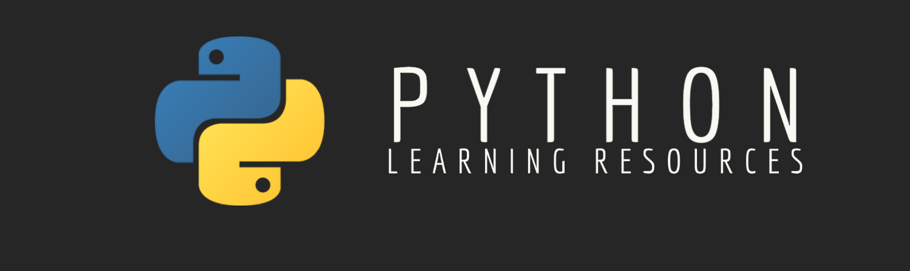

### Learn Python

    

- Python [Docs](https://docs.python.org/3/) : Official Documentation

- #### Courses/Tutorials
  - [Udemy Complete Python Bootcamp](https://www.udemy.com/course/complete-python-bootcamp/) : Learn Python like a Professional Start from the basics
  - [Python for Absolute Beginners](https://www.udemy.com/course/python-for-absolute-beginners-u/) : Python 101 - learn Python programming from scratch with hands-on exercises in this beginner friendly Python tutorial!
  - [Programming for Everybody (Getting Started with Python)](https://www.coursera.org/learn/python) : This course aims to teach everyone the basics of programming computers using Python. **ONE OF THE BEST ONE**
  - [Python Programming Tutorials](https://pythonprogramming.net/python-fundamental-tutorials/) : Getting Started with the basics of programming with Python 3!
  - [Full Stack Python](https://www.fullstackpython.com/) : Full Stack Python explains programming concepts in plain language and provides links to the best tutorials for those topics.

- #### YouTube Channels
  - [CodeWithHarry](https://www.youtube.com/watch?v=aqvDTCpNRek&list=PLu0W_9lII9agICnT8t4iYVSZ3eykIAOME) : This Python Tutorials in Hind,i will teach you all the Python basics needed to master python in a very short span of time.
  - [Amulya's Academy](https://www.youtube.com/channel/UCIgXF0FrYJL0a6sMsRIsLvA) : This is the series of free video tutorials on python programming language for beginners and all these videos will help you to learn the language from the basics
  - [Chris Hawkes](https://www.youtube.com/c/noobtoprofessional/playlists) : Python Beginner Tutorial 1 For Absolute Beginners

- #### Newsletters
     - [Awesome Python Newsletter](https://python.libhunt.com/newsletter) : Weekly overview of the most popular Python news, articles and packages
     - [The PyCoder’s Weekly](https://pycoders.com/) : Free, weekly e-mail newsletter for those interested in Python development and various topics around Python and the communi‍‍‍ty
     - [Improve Your Python With:🐍 Python Tricks](https://realpython.com/python-tricks/) : Get a short & sweet Python Trick delivered to your inbox every couple of days
     - [Python Weekly](https://www.pythonweekly.com/) : Free weekly newsletter featuring the best hand curated news, articles, new releases, tools and libraries, events etc related to Python
 
- #### Podcasts
     - [Django Chat](https://djangochat.com/) : Podcast on the Django Web Framework by William Vincent and Carlton Gibson
     - [Podcast.__init__](https://www.pythonpodcast.com/) : Aims to make a podcast for the Python community that is helpful, informative, and entertaining. By answering this survey you can help us find out how well we are achieving those goals.
     - [PythonBytes](https://pythonbytes.fm/) : Python headlines delivered directly to your earbuds
     - [Running in Production](https://runninginproduction.com/) : Podcast where folks talk about running small & large web apps in production. Topics include tech stacks, lessons learned and DevOps / deployment tips.
     - [Talk Python To Me](https://talkpython.fm/) : A podcast on Python and related technologies
     - [Test & Code](https://testandcode.com/) :Python Testing for Software Engineering Because Software Engineering should include more testing
     - [The Real Python Podcast](https://realpython.com/podcasts/rpp/) : Python Tips, Interviews, and More
 
