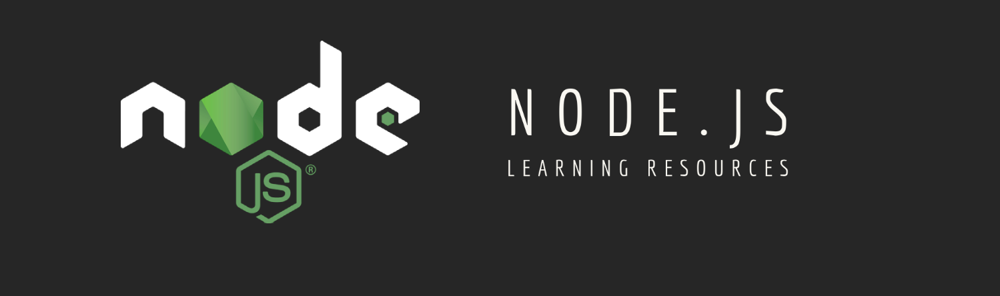

### Learn Node.js

    

- Node.js [Docs](https://nodejs.org/en/) : Official Documentation

- #### Courses/Tutorials
  - [Node.js A to Z](https://www.youtube.com/playlist?list=PLatXnLy-YGQexU9sktggQbw7tq815yGbR) :  YouTube Playlist covering all the basic topics for Backend development in Node.js.
  - [The Complete Node.js Developer Course (3rd Edition)](https://www.udemy.com/course/the-complete-nodejs-developer-course-2/?LSNPUBID=JVFxdTr9V80&ranEAID=JVFxdTr9V80&ranMID=39197&ranSiteID=JVFxdTr9V80-HtOS5_AYt5_J52pcVOoQsw&utm_medium=udemyads&utm_source=aff-campaign) : Learn Node.js by building real-world applications with Node, Express, MongoDB, Jest, and more!
  - [Node JS: Advanced Concepts](https://www.udemy.com/course/advanced-node-for-developers/?ranMID=39197&ranEAID=JVFxdTr9V80&ranSiteID=JVFxdTr9V80-HiC1LUSj.H7DeYtfEft2Rg&LSNPUBID=JVFxdTr9V80&utm_source=aff-campaign&utm_medium=udemyads) : Get advanced with Node.Js! Learn caching with Redis, speed up through clustering, and add image upload with S3 and Node!
  - [Learn Nodejs by building 12 projects](https://www.udemy.com/course/learn-nodejs-by-building-10-projects/?LSNPUBID=JVFxdTr9V80&ranEAID=JVFxdTr9V80&ranMID=39197&ranSiteID=JVFxdTr9V80-nj_p9FudxWLM36cbzkPTEA&utm_medium=udemyads&utm_source=aff-campaign) : Become an Expert Nodejs Developer While Building Real World Applications
  - [Beginner's Series to: Node.js](https://www.youtube.com/playlist?list=PLlrxD0HtieHje-_287YJKhY8tDeSItwtg) : Series of practical, byte-sized videos about Node.js for beginners so you can get up to speed quickly
  -  : 

- #### YouTube Channels
  - [The Coding Train](https://www.youtube.com/watch?v=RF5_MPSNAtU&amp;t=28s) : The Coding Train is on its way with creative coding video tutorials on subjects ranging from the basics of programming languages like JavaScript to Node.js
  - [Traversy Media](https://www.youtube.com/c/TraversyMedia/playlists) : Traversy Media features the best online web development and programming tutorials for all of the latest web technologies including Node.js, Angular 2, React.js, PHP, Rails, HTML, CSS and much more
  - [Academind](https://www.youtube.com/channel/UCSJbGtTlrDami-tDGPUV9-w) : Academind YouTube channel has more than 400 videos based on teaching different and also explaining important concepts in Node.js.

- #### Articles
    - [The Node Way](http://thenodeway.io/) : Entire philosophy of Node.js best practices and guiding principles exists for writing maintainable modules, scalable applications, and code that is actually pleasant to read.
    - [Portable Node.js guide](https://github.com/ehmicky/cross-platform-node-guide) : How to write cross-platform Node.js code.
    - [You Dont Know Node](https://github.com/azat-co/you-dont-know-node) : Node is everywhere. What if the world can be a better place if more developers master Node?
    - [Stream-Handbook](https://github.com/substack/stream-handbook): How to write Node.js programs with streams.
    - [Module Best Practices](https://github.com/mattdesl/module-best-practices) :  This article deals specifically with front- and back-end Node/CommonJS modules hosted on npm, but the same concepts may apply elsewhere.
    - [Microsoft + Node.js Guidelines](https://github.com/Microsoft/nodejs-guidelines) :  For people using Microsoft services and technologies to get started on the right foot with Node.js
    - [A Roadmap for Node.js Security](https://nodesecroadmap.fyi/) : This road-map by Node.js Enthusiasts discusses how some Node.js projects address security challenges, along with ways to make it easier for more projects to address these challenges in a thorough and consistent manner.
    - [Learn the Node.js Runtime Itself](https://www.freecodecamp.org/news/before-you-bury-yourself-in-packages-learn-the-node-js-runtime-itself-f9031fbd8b69/) : The article will challenge the very limits of your Node.js knowledge.
    - [Best Practices for Express in Production](https://strongloop.com/strongblog/best-practices-for-express-in-production-part-two-performance-and-reliability/) : Some best practices for running Express applications in production
    - [External Resources on Node.js](https://guides.codepath.com/nodejs) :  Central crowd-sourced resource for complete and up-to-date Node.js content and tutorials
    - [Resource Collection for Node.js](https://nodesource.com/resources/) : NodeSource Articles are one of the best free reads on Node.js

- #### Understanding Tougher Topics  
  - [Why Asynchronous?](https://nodesource.com/blog/why-asynchronous/) : Defining "Asynchronous Programming"
  - [Understanding the Node.js Event Loop](https://nodesource.com/blog/understanding-the-nodejs-event-loop/) : This post will shed light on how the event loop operates so you too can enjoy the magic.
  - [Understanding Object Streams](https://nodesource.com/blog/understanding-object-streams/) : This article will explain what exactly object streams are, how they behave in contrast to regular streams, and how we can use them ourselves.
  - [Using Express to Quickly Build a GraphQL Server](https://snipcart.com/blog/graphql-nodejs-express-tutorial) : Craft a GraphQL server using Node.js Express
  

- #### Cheat Sheets
  - [Express.js 4 Cheatsheet](https://github.com/azat-co/cheatsheets/tree/master/express4) : Beautifully-designed print-ready PDF
  - [Strong Node.js](https://github.com/jesusprubio/strong-node) : Exhaustive checklist to assist in a security review of a Node.js web service code.

- #### Books
  - [Learning Spring Boot 2.0 2nd Edition](https://github.com/learning-spring-boot/learning-spring-boot-2nd-edition-code) : Learn how to use Spring Boot to build apps faster than ever before
  - [Full Stack JavaScript: Learn Backbone.js, Node.js and MongoDB](https://github.com/azat-co/fullstack-javascript) : Full Stack JavaScript, 3rd Edition is a work of 30+ in-person courses, workshops and classes delivered.
  - [Mixu's Node Book](http://book.mixu.net/node/) : Book about using Node.js
  - [Node.js Notes for Professionals](http://goalkicker.com/NodeJSBook) : The Node.js Notes for Professionals book is compiled from Stack Overflow Documentation, the content is written by the beautiful people at Stack Overflow.
  - [Node.js Succinctly, Syncfusion](https://www.syncfusion.com/resources/techportal/ebooks/nodejs) : Node is one of the Succinctly Series On The Go (email address *requested*, not required)
  - [Practical Node.js: Building Real-World Scalable Web Apps](https://github.com/azat-co/practicalnode) : Practical Node.js, 1st and 2nd Editions [Apress] 
  - [The Node Beginner Book](http://nodebeginner.org) : Book to get you started with developing applications with Node.js, teaching you everything you need to know about "advanced" JavaScript along the way
  - [Node.js Design Patterns by Mario Casciaro](https://github.com/PacktPublishing/Node.js_Design_Patterns_Second_Edition_Code) :  Book Advanced level on Node.js Design Patterns 
  

