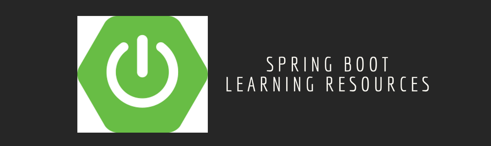

### Learn Spring Boot

    

- Spring Boot [Docs](https://docs.spring.io/spring-boot/docs/current/reference/htmlsingle/) : Official Documentation

- #### Courses/Tutorials
  - [Learn Spring Boot - Rapid Spring Application Development](https://www.udemy.com/course/spring-boot-intro/?LSNPUBID=JVFxdTr9V80&ranEAID=JVFxdTr9V80&ranMID=39197&ranSiteID=JVFxdTr9V80-yKB7doI50JJEGb09MCDGLQ&utm_medium=udemyads&utm_source=aff-campaign) : Spring Boot gives you all the power of the Spring Framework without all of the complexity.
  - [Master Microservices with Spring Boot and Spring Cloud](https://www.udemy.com/course/microservices-with-spring-boot-and-spring-cloud/?LSNPUBID=JVFxdTr9V80&ranEAID=JVFxdTr9V80&ranMID=39197&ranSiteID=JVFxdTr9V80-3N2mJSeqbhprgeDZgQ6eVA&utm_medium=udemyads&utm_source=aff-campaign) : Awesome journey from Restful Web Services ( REST API ) to Microservices with Java, Spring Boot and Spring Cloud
  - [Spring Boot Tutorial](https://www.youtube.com/playlist?list=PLGRDMO4rOGcNSBOJOlrgQqGpIgo6_VZgR) : YouTube Channel with Spring Boot playlist, lists out all the spring boot related tutorials, guides, and development guides.
  - [Spring Boot Security Tutorial](https://www.youtube.com/playlist?list=PLGRDMO4rOGcNmd7-Pm37jOWfjC7ZjhU2V) : YouTube Channel with Spring Boot Security playlist.
  - [Spring Boot Tutorials](https://github.com/RameshMF/spring-boot-tutorial) : Spring Boot Articles, Tutorials, Video tutorials, Projects, Guides, Source code examples etc

- #### Understanding Tougher Topics  
  - [Spring Boot Annotations](https://www.javaguides.net/2018/10/spring-boot-annotations.html) : Articles lists and describes different annotations and their packages.

- #### Style Guide
  - [Spring Boot Style Guide](https://github.com/helpermethod/spring-boot-style-guide) : Opinionated guide on developing web applications with Spring Boot. Inspired by Airbnb JavaScript Style Guide.

- #### Books
  - [Learning Spring Boot 2.0 2nd Edition](https://github.com/learning-spring-boot/learning-spring-boot-2nd-edition-code) : Learn how to use Spring Boot to build apps faster than ever before
